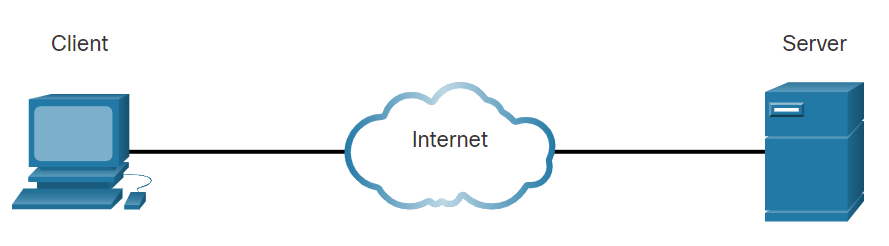
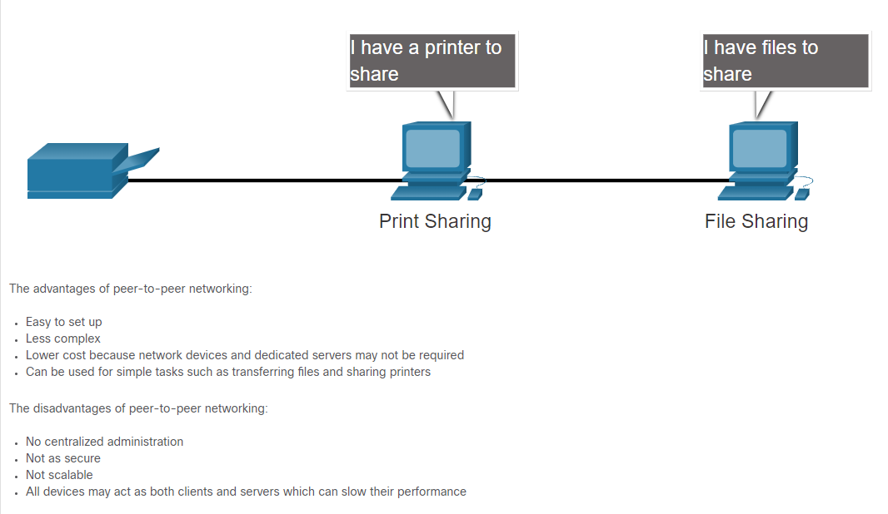
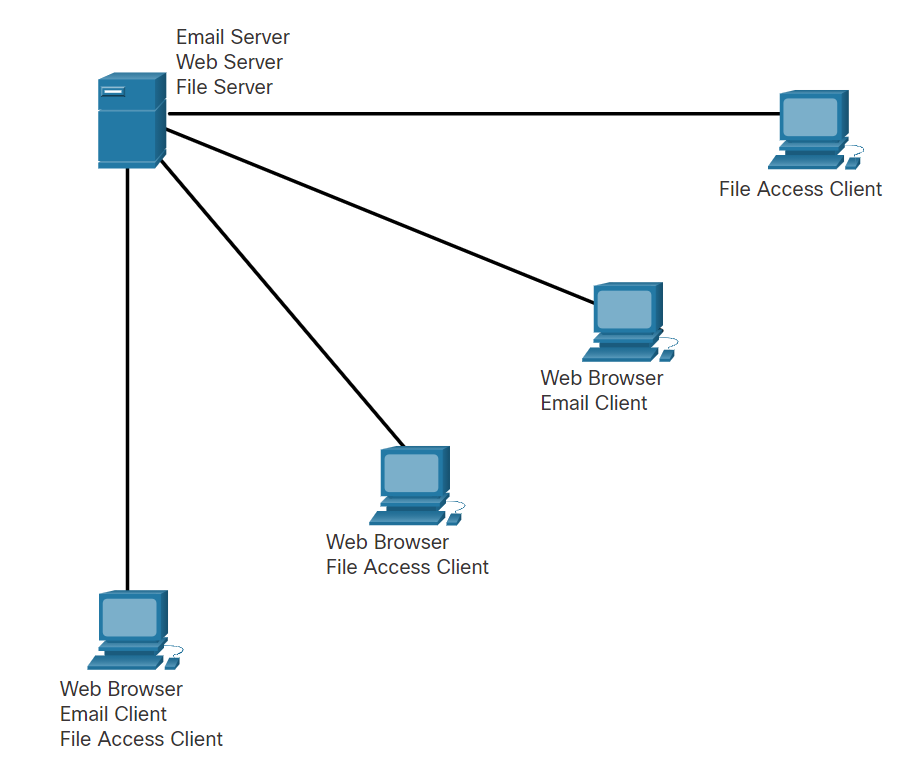
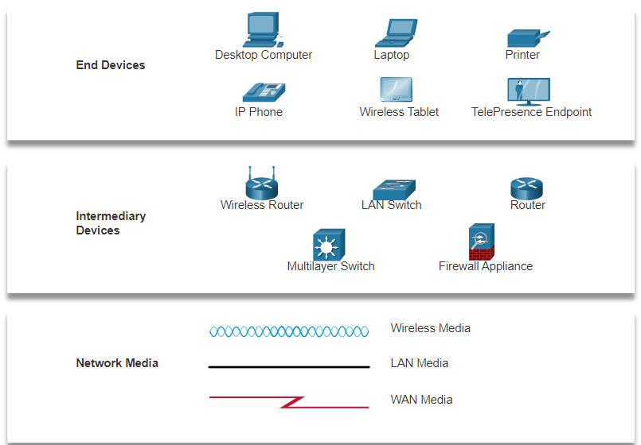

# Networking Essentials
## Local Networks
SOHO: small office / home office networks

**End user devices:** computer, phone, tablet, etc.

**Intermediary devices:** define the path the message is going to take from sender to receiver. (router)

**Internet:** cooperation among the differente people who own the networks, which agree on protocols for communication.

* **Mobile devices:** 
  * Smartphone
  * Tablet
  * Smartwatch
  * Smart Glasses

* **Home devices:**
  * Security system
  * Appliances
  * Smart TV
  * Gaming console

* **Other devices:**
  * Smart cars
  * RFID tags
  * Sensors and actuators
  * Medical devices

---
## Data
* **Volunteered data:** data you are agreeing to share

* **Inferred data:** data inferred from volunteered or observerd data. i.e. general interests, travel location, etc.

* **Observed data:** captured by recording actions of individuals. Location from phone, credit card 

## Data Transmission
* **Electrical signals:** represented by electrical pulses on copper wires
* **Optical signals:** converting electrical signals to light pulses
* **Wireless singals:** infrared, microwave, or radio waves through air 

---
## Bandwidth and Throughput
Bandwidth is the capacity of a medium to carry data. A measure of bits per second that can travel through the network when sending and receiving data. (Theoretical)

Throughput is the measure of the transfer of bits across the media over a given period of time. (The real amount)

>In an internetwork or network with multiple segments, throughput cannot be faster than the slowest link of the path from sending device to the receiving device.
---
## Clients and Servers

**Servers** are hosts that have software installed which enable them to provide information, like email or web pages, to other hosts on the network.

**Clients** are computer hosts that have software installed that enables the hosts to request and display the information obtained from the server. An example of client software is a web browser

### Peer-to-peer(P2P)
Computers running as a Client and a Server at the same time to communicate, using the network to exchange data and services with each other.

The performnce can slow down as they are acting as clients and servers at the same time.

### Multiple Roles in a Network

***
# Network components

The network infrastructure contains three categories of hardware components: **intermediate devices, end devices, and network media**. Devices and media are the physical elements, or hardware, of the network. Hardware is often the visible components of the network platform such as a laptop, PC, switch, router, wireless access point, or the cabling used to connect the devices. The network devices that people are most familiar with are called end devices, or hosts. These devices form the interface between users and the underlying communication network. An end device (or host) is either the source or destination of a message transmitted over the network.
