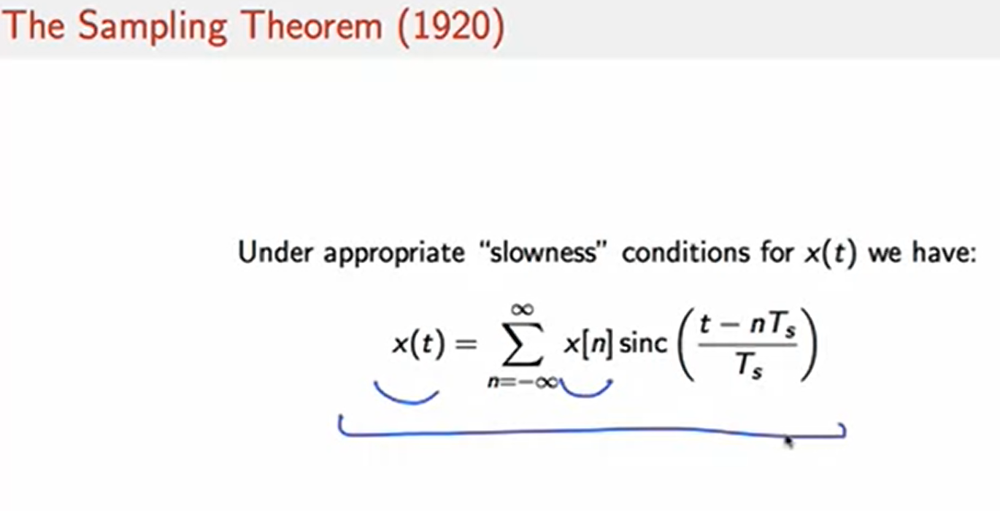
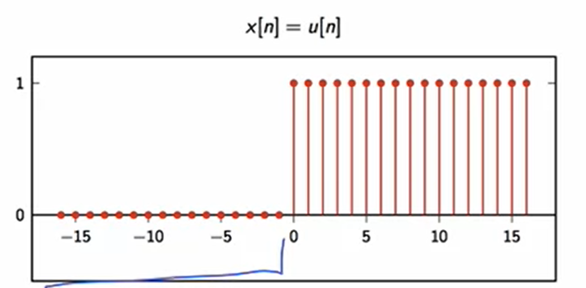

## Sampling Theorem

We can build a signal by a linear combination of sinc functions shifted and scaled by the values of a discrete sequence.

Digital signals are easier to handle than analog signals for:
- Storage
- Processing
- Transmission

## Transmitting analog signals

Analog signals during transmission process suffer from **Gain reduction** and **Noise**.

Adding **Gain** back to the signal to get back the original amplitude the noise is amplified as well in the same magnitude **G**

For long channels (overseas transmission) the process repeats as many times as you split your transmission: 

## Transmitting digital signals

At the end of the transmission line there is a threshold detector. This operator reconstructs the signal (0s and 1s) eliminating the noise induced.

Original signal:

Signal after noise is summed along the line:

Digital signal with added **Gain** to undo amplitude loss:

Output signal with a threshold that sets to 5V every value > 0 and to -5V every value < 0.

***
## Summary
### Discretization of time:
- samples replace idealized models
- simple math replaces calculus

### Discretization of values
- general-purpose storage
- general-purpose processing (CPU)
- noise can be controlled
 
---

 # Discrete time signals

## Delta Dirac

## Unit Step

## Exponential Decay

## Sinusoid

***
## Four signal classes:
- Finite-length
- Infinite-length
- Periodic
- Finite-support

### Finite-length

### Infinite-length

### Periodic

### Finite-support

## Elementary Operators:

## Energy and Power:

