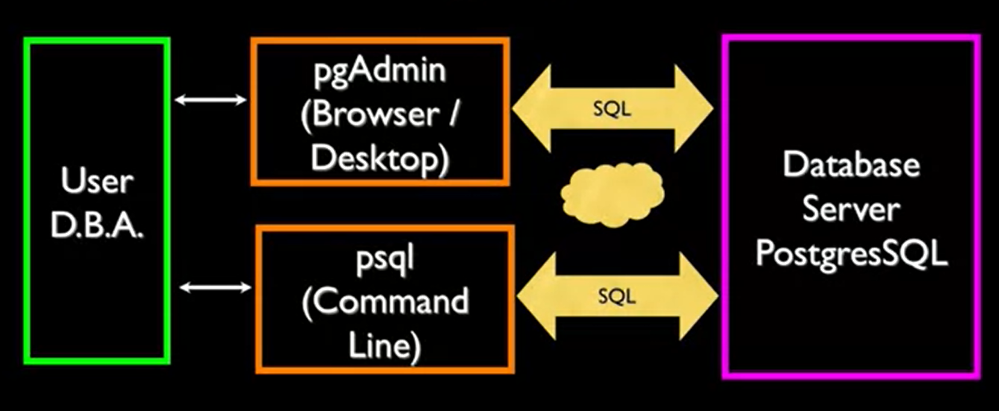
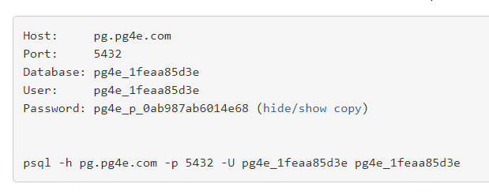

# History of relational databases

- External View (View)
- Conceptual Level (Schema)
- Internal Level (Schema)
- Database (Physical Level)

**Database:** contains one or more tables.

**Relation / Table:** contains tuples and attributes.

**Tuple / Row:** a set of fields which generally represent an object like a person or music track.

**Attribute / Column or Field:** one of possibly many elements of data corresponding to the object represented by the row.

***
# SQL Architecture 



## Commands:
### Login as superuser
``````
$psql -U postgres 
``````
### List databases (logged as superuser):
``````
\l
``````
### Create Role:
``````
CREATE USER x WITH PASSWORD 'y';
``````
### Create Database:

``````
CREATE DATABASE z WITH OWNER 'x';
``````
### Quit:
``````
\q
``````
### Connect to database as user:
``````
psql <database> <username>
``````
### List tables:
``````
\dt
``````
### Create Table:
``````
CREATE TABLE <tname>(
    <field1> <type1> (<size1>),
    <field2> <type2> (<size2>)    
);

// example

CREATE TABLE users(
    name VARCHAR(128),
    email VARCHAR(128)    
);
``````
### Show schema of table:
``````
\d+ <tablename>
``````


***
# INSERT
``````
INSERT INTO <tname> (<field1> <field2>) VALUES (<value1> <value2>)   
);

// example

INSERT INTO users( name, email) VALUES ('Tom', 'tom@gmail.com');
``````
# DELETE
``````
DELETE FROM users WHERE email='tom@gmail.com';
``````
# UPDATE
``````
UPDATE users SET email='tom.updated@gmail.com' WHERE name='Tom';
``````
# ORDER BY
``````
SELECT * FROM users ORDER BY email ASC/DESC;
``````
# LIKE
``````
SELECT * FROM users WHERE email LIKE '%o%';
``````
**%** is a wildcard
# LIMIT/OFFSET
First n rows from begginning 
``````
SELECT * FROM users ORDER BY email DESC LIMIT 3;
``````
or after skipping some rows
``````
SELECT * FROM users ORDER BY email OFFSET LIMIT 3;
``````
# COUNT
Retrieve the count of the rows instead if the content 
``````
SELECT COUNT(*) FROM users;
SELECT COUNT(*) FROM users WHERE email='tim@mail.com';
``````
