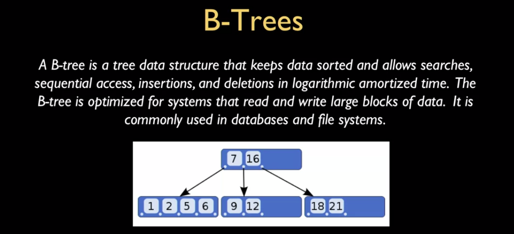
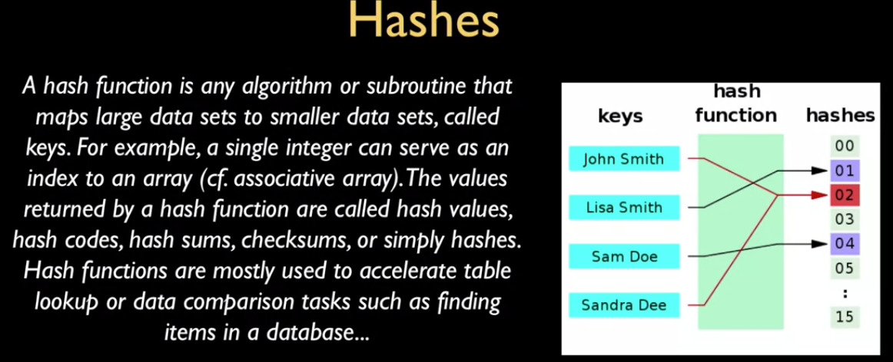
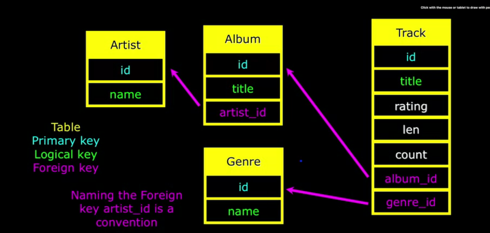
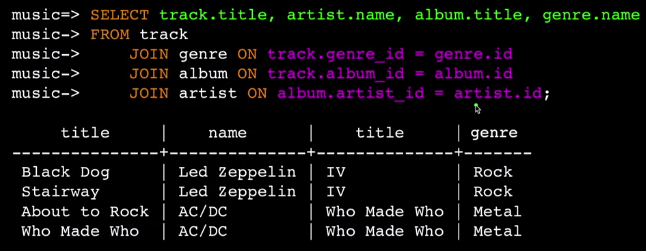

# History of relational databases

- External View (View)
- Conceptual Level (Schema)
- Internal Level (Schema)
- Database (Physical Level)

**Database:** contains one or more tables.

**Relation / Table:** contains tuples and attributes.

**Tuple / Row:** a set of fields which generally represent an object like a person or music track.

**Attribute / Column or Field:** one of possibly many elements of data corresponding to the object represented by the row.

***
# SQL Architecture 


## Commands:
### Login as superuser
``````
$psql -U postgres 
``````
### List databases (logged as superuser):
``````
\l
``````
### Create Role:
``````
CREATE USER x WITH PASSWORD 'y';
``````
### Create Database:

``````
CREATE DATABASE z WITH OWNER 'x';
``````
### Quit:
``````
\q
``````
### Connect to database as user:
``````
psql <database> <username>
``````
### List tables:
``````
\dt
``````
### Create Table:
``````
CREATE TABLE <tname>(
    <field1> <type1> (<size1>),
    <field2> <type2> (<size2>)    
);

// example

CREATE TABLE users(
    name VARCHAR(128),
    email VARCHAR(128)    
);
``````
### Show schema of table:
``````
\d+ <tablename>
``````


***
# Data Types
## String Fields
- **CHAR(n)** allocates entire space (faster fro small strings of fixed known length, e.g. hashes, etc.)
- **VARCHAR(n)** allocates variaable space depending on data length
##  Text Fields
- **TEXT**: paragraphs, ont used woth indexing or sorting
## Binary Fields
## Integer Fields
- **SMALLINT** (-32768, 32767)
- **INTEGER** (2 Billion)
- **BIGINT** (10exp18)
## Floating Point Numbers
- **REAL** (32-bit) 7 digits of accuracy
- **DOUBLE PRECISION** (64-bit) 14 digits of accuracy
- **NUMERIC(accuracy, decimal)** *accuracy* digits of accuracy and *digits* of decimal (used for money)
## DATES
- **TIMESTAMP** 'YYYY-MM-DD HH:MM:SS'
- **DATE** YYYY-MM-DD
- **TIME** HH:MM:SS
- **NOW()**
***
# Keys and indexes
## AUTO_INCREMENT
```
CREATE TABLE users(
    id SERIAL,
    ...
    email VARCHAR(128) UNIQUE,
    PRIMARY KEY(id)
```


# INSERT
``````
INSERT INTO <tname> (<field1> <field2>) VALUES (<value1> <value2>)   
);

// example

INSERT INTO users( name, email) VALUES ('Tom', 'tom@gmail.com');
``````
# DELETE
``````
DELETE FROM users WHERE email='tom@gmail.com';
``````
# UPDATE
``````
UPDATE users SET email='tom.updated@gmail.com' WHERE name='Tom';
``````
# ORDER BY
``````
SELECT * FROM users ORDER BY email ASC/DESC;
``````
# LIKE
``````
SELECT * FROM users WHERE email LIKE '%o%';
``````
**%** is a wildcard
# LIMIT/OFFSET
First n rows from begginning 
``````
SELECT * FROM users ORDER BY email DESC LIMIT 3;
``````
or after skipping some rows
``````
SELECT * FROM users ORDER BY email OFFSET LIMIT 3;
``````
# COUNT
Retrieve the count of the rows instead if the content 
``````
SELECT COUNT(*) FROM users;
SELECT COUNT(*) FROM users WHERE email='tim@mail.com';
``````
***
# Relational Database Design
> DON'T REPLICATE STRING DATA IN A SAME FIELD (Vertical replication)
### **Primary Key:** integer-auto increment (tablname_id). 
### **Logical Key:** what users use for lookup
### **Foreign Key:** integer pointing to a row on another table
> Integer primary keys ae what makes databases work fast, avoid setting strings as PKs or foreign keys 

> Add a special **key** column to each table to reference to  


# JOIN
### INNER JOIN
- Links across several tables
- Need to specify hoe to use keys using an **ON** clause
```
SELECT album.title, artist.name 
FROM album JOIN artist 
ON album.artist_id = artist.id
```

### CROSS JOIN
Get all combinations unfiltered (no **ON** clause)

# ON DELETE choices
- **DEFARLUT / RESTRICT** Don't allow changes that restrict the constraint
- **CASCADE** Adjust child rows by reomving or updating to maintain consistency
- **SET NULL** Set the foreign key columns in the child rows to null