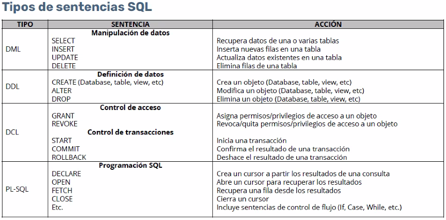

**Dato:** unidad minima ade informacion

**Definición de datos:** tipología de la estructura 

**Control de concurrencias:** verifica la consistencia de cada operación y asegura que nose creen conflitos al momento de operar en un mismo registro de forma simultánea.

**Tablas:** Objeto principal de una base de datos.
 Campos (columnas) y registros (filas).

> No se puede tener registros repetidos en una tabla bien diseñada

**Clave primaria:** Identificador único de cada registro