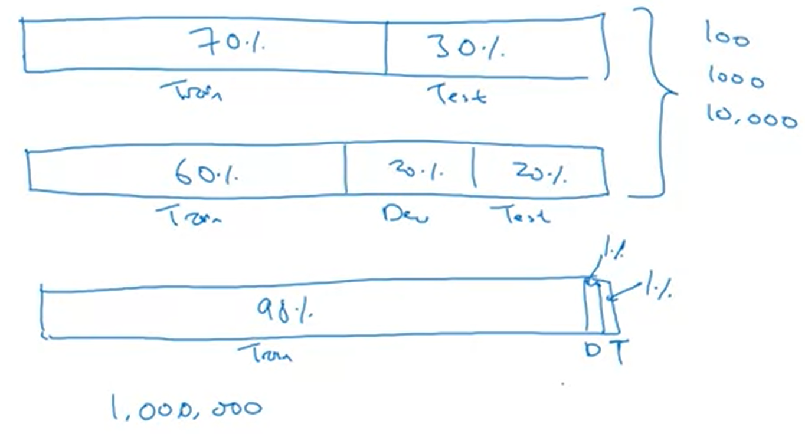
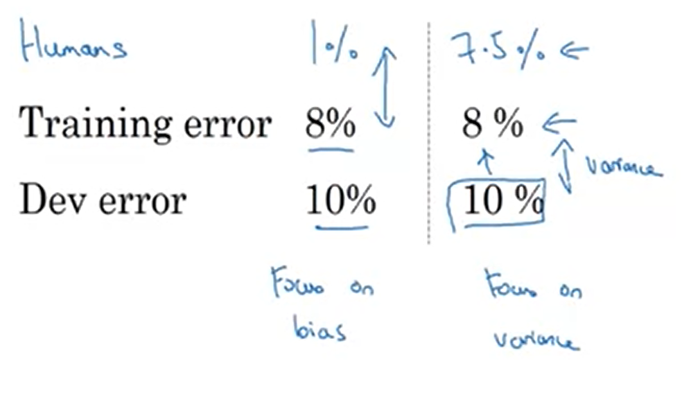
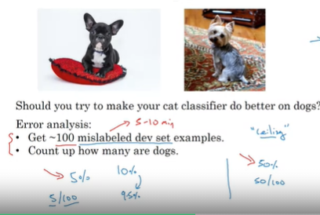
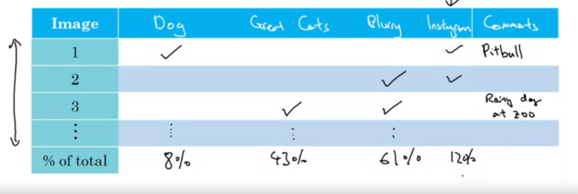

# Structuring Machine Learning Proyects:
## Ortogonalization: 
separate features in a way the variation of one does not modify another. You need to be able to adjust parameters independently.

## Chain of assumptions:

### Supervised Learning:
- Fit training set well on cost function
    - Bigger network
    - Adam
- Fit dev set well on cost function
    - Regularization
    - Bigger training set
- Fit test set well on cost function
    - Bigger dev set
- Performs well in real world
    - Change dev set
    - Cost function

> avoid using early stopping if possible as it modifies performance on both training set and dev set.

***
## Single number evaluation metric:
To test multiple models performance use a single metric (precision, recall, etc.). A good metric that involves P and R is F1Score=(2/  1/P + 1/R) harmonic mean. For this it helps to have a good dev set where to evaluate the metric.

If you have many dev sets calculate the average of the score to get a performance estimate.
***
### Satisficing and Optimizing Metric:
When having N metrics, chose 1 to optimise (look for best value) and N-1 to satisfice(set an acceptable value as threshold to filter results)
***
# Dev/Test set selection
Make **Dev** and **Test** sets come from same distribution by randomly shuffling entire dataset. 
> Choose a **dev** set and **test** set to reflect data you expect to get in the future and consider important to do well on.

If your Dev set and your Train set contain very different data, you could spend a lot of time improving model performance on Dev set with poor results when evaluating in Test.

## Size of each set

>Set your **test** set to be big enough to give high confidence in the overall performance of your system.
***
## When to change Dev/Test Sets and metrics
Sometimes the model which better performs the task is not the one with the best metric chosen.

One way to change and adjust metrics is by adding weights to errors, penalizing specific incorrect decisions.

### Orthogonalization steps:
1. Place target where you want your model and define appropriate metric
2. Worry separately about how to do well on this metric
>If doing well on your metric and dev/test set does not correspond to doing well on final application, change metric and/or dev/test set. Don't spend too long coming up with the perfect metric and dev set.
***
## Comparing to Human-level performance
**Bayes optimal error:** best possible error which may not be 0% due to impossibility to determine if decision is correct based on dataset (image too blurry, audio too noisy, etc.)

When ML accuracy is worse than human decision some options are:
- Get labeled data from humans
- Gain insights from manual error analysis (Why did a person get it rigth?)
- Better analysis of bias/variance

## Avoidable Bias
**The error difference between training error and Bayes optimal error**

Try to minimize the biggest gap between 

**Human performance - Training error - Dev error**

If training set is doing much worse than humans try to better fit model to training data (reduce bias). 

If training data is doing similar to humans but dev performance is not as close as train, try to fix overfitting (reduce variance).

## Improving model performance
The model is successful when:
1. It fits the **training** set quite well
2. The **training** set performance generalizes pretty well to the **dev/test** set

To achieve this:
1. Reduce avoidable bias to the minimum
    - Train bigger model
    - Train longer / better optimization algorithms
        - Momentum
        - RMSprop
        - Adam
    - Change NN architecture / tune hyperparameters search
        - Activation function
        - N of layers in the hidden units
        - Try RNN or CNN
2. Reduce variance
    - Get more data
    - Reguralization
        - L2 regularization
        - Dropout
        - Data augmentation
    - Change NN architecture / tune hyperparameters search

    test dev diff
    errror smaller than human-level 

     Sometimes we'll need to train the model on the data that is available, and its distribution may not be the same as the data that will occur in production. Also, adding training data that differs from the dev set may still help the model improve performance on the dev set. What matters is that the dev and test set have the same distribution.

***
# Error Analisys
Quick analysis:
> Get ~100 misclassified samples and look for patterns to see what is your ceiling if you decide to correct a specific misclassification problem.
>

Evaluate multiple errors in parallel:
