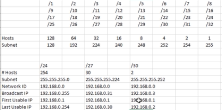

# Layer 4 - Transport Layer
## TCP
### Transmission Control Protocol
Connection oriented protocol
- High reliability (HTTP/HTTPS/SSL)
#### Tree-way handshake
- SYN --> SYN ACK --> ACK
***
## UDP
### User Datagram Protocol
Connectionless protocol
- Streaming
- Voice over IP
- DNS
***
### Common Ports and Protocols
- TCP
  - FTP (21) - File transfer protocol
  - SSH (22) - Encrypted connection to another machine
  - Telnet (23) - Log in to a machine remotely
  - SMTP (25) - Mail
  - DNS (53) - Domain name system
  - HTTP (80) - Non secure
  - HTTPS (443) - Secure
  - POP3 (110) - Mail
  - SMB (139 + 445) - Samba / file share
  - IMAP (143) - Mail
- UDP
  - DNS (53)
  - DHCP (67, 68) - Dynamic association to an IP
  - TFTP (69)
  - SNMP (161) - Simplr network management protocol

# OSI Model
(**P**lease **D**o **N**ot **T**hrow **S**ausage **P**izza **A**way)
1. Physical
   - data cables, cat6
2. Data
   - Switch, MAC addresses  
3. Network
   - IP addresses, routing
4. Transport
   - TCP/UDP
5. Session
   - Session management
6. Presentation
   - WMV, JPEG, MOV (media)
7. Application
   - HTTP, SMTP 

Receiving data: 1 --> 7

Sending data: 7 --> 1

# Subnetting

# Packet Tracer
Router CLI -> en or enable: enables router config -> show ip interface brief/etc

Enter configuration commands:
   - configure
     - interface fastEthernet 0/0
       - ip address 192.168.0.1 255.255.255.0
       - do show ip interface brief 
       - not shutdown :open port
       - shutdown: put port down
       - exit
     - exit
 - wr: write changes
 - service dhcp
 - show run